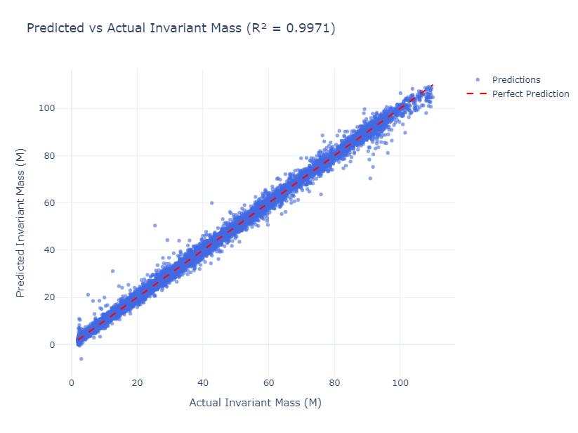

# 🪐 Invariant Mass Prediction from Dielectron Events (CERN Open Data)

This project focuses on predicting the **invariant mass (M)** of electron pairs (`e⁺e⁻`) in proton-proton collisions using machine learning models trained on event-level kinematic features.

The dataset is derived from CMS open data and contains over 100,000 dielectron events, selected for education and outreach. The goal is to regress the invariant mass based on measurable electron properties like energy, momentum, pseudorapidity, and azimuthal angle.

---

## 📄 About the Dataset

These data were sourced from the [CERN Open Data Portal](https://opendata.cern.ch/record/304), provided by the CMS experiment. The dataset includes events from various `Run` periods and contains a subset of information typically used in high-energy physics analysis.

- **Target Variable**: `M` – Invariant Mass of the dielectron system (GeV)
- **Features Include**:
  - Electron energy (`E1`, `E2`)
  - 3D momentum components (`px`, `py`, `pz`)
  - Transverse momentum (`pt1`, `pt2`)
  - Pseudorapidity and phi angle (`eta`, `phi`)
  - Electron charge (`Q1`, `Q2`)
- **Data Range**: Invariant mass values between ~2 and 110 GeV

📚 Original dataset: [CMS Open Data](https://opendata.cern.ch/record/304) (CC0 license)

---

## 🧠 Models Used

- **SGDRegressor (Default)**: Default Parameters
- **XGBoost Regressor (Default)**: Default Parameters
- **XGBoost Regressor (Tuned via Optuna)**: {'n_estimators': 1380, 'max_depth': 6, 'min_child_weight': 2, 'learning_rate': 0.14590668695592526, 'subsample': 0.5175770108286383,    'colsample_bytree': 0.7728150113481782, 'reg_alpha': 4.600105866026521, 'reg_lambda': 2.4349838401484676}
---

## 🔧 Preprocessing

# Removed values where 'M' is null
# Dropped identifiers ('Run', 'Event')
# Removed extreme or non-physical values:
    E1 (Energy of electron 1) was limited to values less than 450 GeV
    px1 (x-component of momentum for electron 1) was restricted to values greater than -130 GeV
    py1 (y-component of momentum for electron 1) was restricted to values less than 120 GeV
    pt1 (transverse momentum of electron 1) was limited to below 130 GeV
    eta1 (pseudorapidity of electron 1) was filtered to be greater than -4
    E2 (Energy of electron 2) was capped at 620 GeV
    px2 (x-component of momentum for electron 2) was required to be between -120 and 120 GeV
    py2 (y-component of momentum for electron 2) was constrained to the range -100 to 120 GeV
    pz2 (z-component of momentum for electron 2) was filtered to values between -500 and 520 GeV
    pt2 (transverse momentum of electron 2) was limited to values less than 130 GeV
    eta2 (pseudorapidity of electron 2) was filtered to be greater than -6
# Engineered several new features using physics-informed relationships between the electron kinematics. Some were inspired by chat-gpt. These included:
    same_sign: binary indicator for whether both electrons have the same charge
    p1_magnitude, p2_magnitude: reconstructed full 3D momentum magnitudes
    momentum_diff_mag: Euclidean distance between electron momenta
    total_energy: combined energy of both electrons
    delta_eta, delta_phi: angular separation between the two electrons
    pt_ratio, total_pt, eta_sum: additional kinematic descriptors
# Split data
# Compared StandardScaler and RobustScaler on SGDRegressor. StandardScaler performed better

---

## 📊 Model Performance

| Model                      | Cross-Validation R² | Cross-Validation RMSE  | Test R² | Test RMSE |
|----------------------------|---------------------|------------------------|---------|-----------|
| XGBoost Regressor (Optuna) | Null                | 1.383                  | 0.9971  | 1.345     |
| XGBoost Regressor (Default)| 0.9928              | 2.142                  | 0.9926  | 2.148     |
| XGBoost Regressor (KBest)  | 0.9855              | 3.006                  | Null    | Null      |
| SGD Regressor (Standard)   | 0.5318              | 17.30                  | Null    | Null      |
| SGD Regressor (Robust)     | 0.5299              | 17.34                  | Null    | Null      |

*Sorted by Test RMSE

---

### Optuna Tuning (XGBoost)

Best hyperparameters found:

XGBRegressor
{
  "n_estimators": 1380,
  "max_depth": 6,
  "learning_rate": 0.14590668695592526,
  "subsample": 0.5175770108286383,
  "colsample_bytree": 0.7728150113481782,
  "reg_alpha": 4.600105866026521,
  "reg_lambda": 2.4349838401484676,
  "min_child_weight": 2
}

