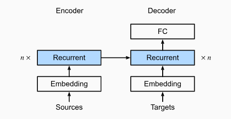
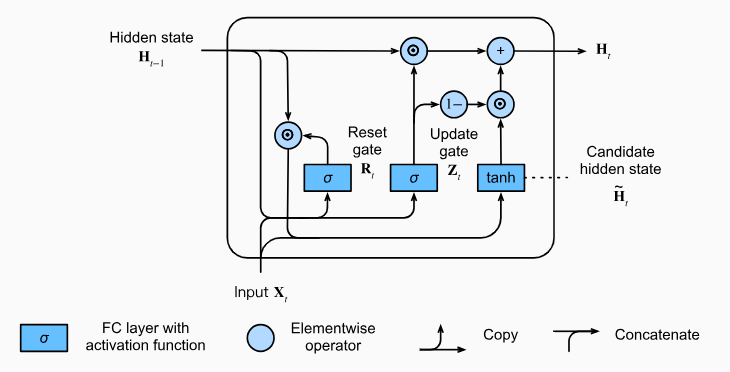

# English–Japanese GRU Translator – NumPy Implementation from Scratch

In this project, I created a machine translation model using an encoder–decoder architecture built entirely from scratch in NumPy, without using any deep learning frameworks. The model translates from English to Japanese using a GRU (Gated Recurrent Unit).

## Problems faced

I faced quite a few problems. The first few problems were in the GRU's backpropagation. I used matrix multiplication when I should have used Hadamard for a few calculations like dz = dh * (h_prev - c_t) and dc_preact = dc * (1 - c**2). Then I was resetting the gradient of x inside the loop so it was not accumulating across time steps. The next error I found was that I was not clipping the output layer weights and using too large of a batch size (32). This caused the decoder to almost always start its predictions with: 'トム' (Tom). Many of the Japanese sentences started with 'Tom'. Because I didn't clip the gradients, the output bias was most likely adding a huge number to 'ト' at the beginning of each sentence. The batch size being high also caused 'トム' to appear more than a few times each batch. Adding attention would be a cool addition, but it wouldn't be meaningful because my encoder length is 3. If I make it any larger, it would take way too long to train on a CPU.

## Dataset

Sentence pairs from the Tatoeba Project  
- Only sentence pairs with ≤ 3 English words  
- English: Lowercased, removed non-alphanumeric characters
- Japanese: Kept Hiragana, Katakana, Kanji, and punctuation (。、！？)
- Removed duplicate English sentences

## Architecture

| Component | Role                                 | Details                                 |
|-----------|--------------------------------------|-----------------------------------------|
| Embedding | Learnable word/char vectors          | 64-dim embeddings for both languages    |
| Encoder   | GRU processes English sequence       | Final hidden state used as context      |
| Decoder   | GRU generates Japanese one char/time | Initialized with encoder’s final state  |
| Output    | FC layer + Softmax                   | Predicts next Japanese character        |

Encoder-Decoder Architecture:

## GRU Architecture and Implementation

The Gated Recurrent Unit (GRU) is an RNN cell designed to assist with the vanishing/exploding gradient problem and capture long range dependencies more efficiently than a vanilla RNN. Below is a overview of the implementation.

- Reset Gate (R): Determines how much of the past hidden state to forget.
- Update Gate (Z): Determines how much of the new candidate state to use versus retaining the past hidden state.
Rₜ = σ(xₜ @ W_r.T + hₜ₋₁ @ U_r + b_r)
### Forward Pass (per time step \(t\))
1. Compute gates
    - Rₜ = σ(xₜ @ W_r.T + hₜ₋₁ @ U_r + b_r)
    - Zₜ = σ(xₜ @ W_z.T + hₜ₋₁ @ U_z + b_z)
2. Candidate state 
    - Cₜ = tanh(xₜ @ W_c.T + (Rₜ ⊙ hₜ₋₁) @ U_c + b_c)
3. Hidden state update
    - xₜ = zₜ ⊙ hₜ₋₁ + (1 - Zₜ) ⊙ Cₜ

### Gradient Calculations

Calculating the gradients is a tedious process, below are my calculations to get this model to work. There were a lot of problems.

## Implementation

- Fully manual GRU forward and backward passes
- Xavier initialization for all weights
- Masked cross-entropy loss for padding
- Training loop includes:
  - Encoder forward
  - Decoder forward with teacher forcing
  - Gradient calculation and manual updates
  - Embedding update step
  - Gradient clipping

Model was trained for 1040 epochs before early stopping occured. Used SGD (lr=0.008), batch size 8.