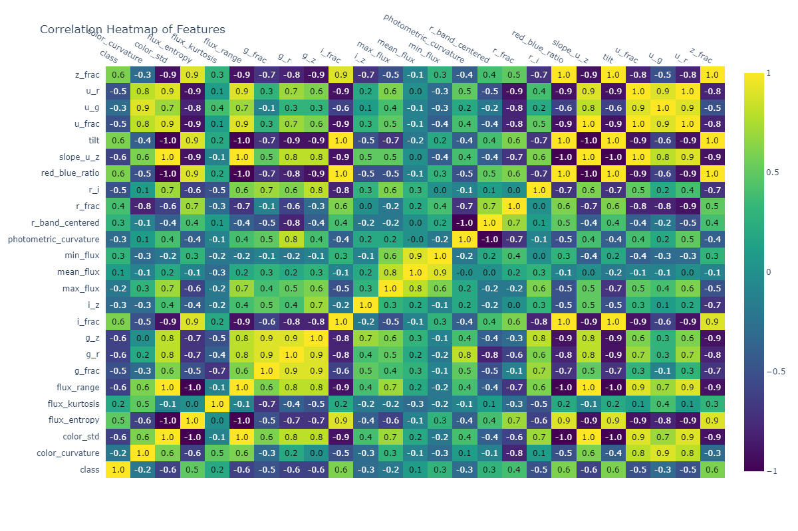
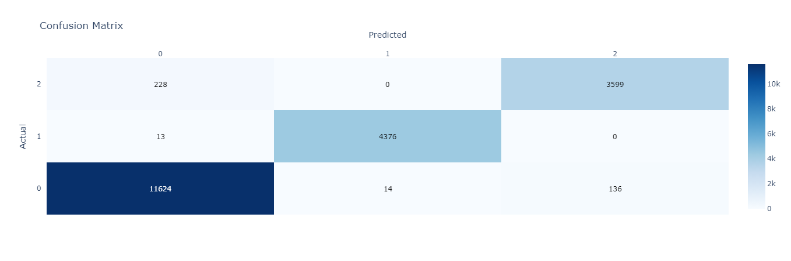

# 🌌 Stellar Classification using SDSS Spectral Data (Galaxy, Star, Quasar)

This project focuses on classifying celestial objects—**galaxies**, **stars**, and **quasars**—based on their **photometric and spectral characteristics**. Using machine learning models trained on enhanced feature representations, we aim to distinguish object types captured by the Sloan Digital Sky Survey.

---

## 📄 About the Dataset

The dataset originates from the [Sloan Digital Sky Survey (SDSS)](https://www.kaggle.com/fedesoriano/stellar-classification-dataset-sdss17) and contains **100,000 observations**, each described by multiple bandpass measurements and identifiers.

- **Target Variable**: `class` — One of `GALAXY`, `STAR`, or `QSO` (quasar)
- **Original Features**:
  - Photometric magnitudes: `u`, `g`, `r`, `i`, `z` (ultraviolet to infrared)
  - Redshift (`redshift`), observation metadata (`plate`, `fiberID`, `run`, `MJD`)
- **Source**:
  - Fedesoriano (2022). [Kaggle Dataset](https://www.kaggle.com/fedesoriano/stellar-classification-dataset-sdss17)
  - Abdurro’uf et al., SDSS DR17 ([arXiv:2112.02026](https://arxiv.org/abs/2112.02026))

---

## 🔧 Preprocessing

### Dropped the following identifier columns and uninformative features:
'obj_ID','alpha','delta','run_ID','rerun_ID','cam_col','field_ID','fiber_ID','spec_obj_ID', 'plate', 'MJD'

### Encoded class
'GALAXY':0, 'STAR':1, 'QSO': 2

### Removed extreme or non-physical observations:
- u (ultraviolet magnitude) was required to be greater than 13 and greater than -4000
- g (green magnitude) was required to be greater than 12 and less than 27.5
- z (infrared magnitude) was required to be greater than 11 and less than 24.5
- r (red magnitude) was limited to values less than 26
- i (near-infrared magnitude) was limited to values less than 2

### Engineered features with chat-gpt as an assistant
| Feature Name                                     | Description                                                                                        |
| ------------------------------------------------ | -------------------------------------------------------------------------------------------------- |
| `u_g`                                            | Difference between UV and green magnitudes; lower values suggest hotter stars.                     |
| `g_r`                                            | Green to red difference; tracks color temperature across visible spectrum.                         |
| `r_i`                                            | Red to near-IR difference; useful for tracking cooler stellar objects.                             |
| `i_z`                                            | Near-IR to IR difference; sensitive to late-type stars or dust-rich galaxies.                      |
| `u_r`                                            | UV to red difference; combines hot and cool band regions for broader contrast.                     |
| `g_z`                                            | Green to IR spread; captures steep color transitions across spectrum.                              |
| `mean_flux`                                      | Mean brightness across all five filters; correlates with total luminosity.                         |
| `max_flux`                                       | Brightest observed band; identifies dominant spectral region.                                      |
| `min_flux`                                       | Faintest observed band; useful for measuring flux contrast.                                        |
| `flux_range`                                     | Difference between max and min flux; shows dynamic range of brightness.                            |
| `slope_u_z`                                      | Normalized gradient between UV and IR; estimates overall color slope.                              |
| `photometric_curvature`                          | Curvature across g–r–i bands; non-zero indicates color bending, useful for separating quasars.     |
| `red_blue_ratio`                                 | IR (i+z) vs UV/green (u+g); separates red/blue dominated objects (e.g. galaxies vs quasars).       |
| `color_std`                                      | Standard deviation of all magnitudes; high variance can indicate variability or dust.              |
| `r_band_centered`                                | Deviation of red band from average of adjacent bands (g and i); isolates local flux shifts.        |
| `u_frac`, `g_frac`, `r_frac`, `i_frac`, `z_frac` | Percent contribution of each band to total flux; encodes where the object's light is concentrated. |
| `flux_kurtosis`                                  | Sharpness of the flux distribution across bands; high values indicate peak-dominated light.        |
| `color_curvature`                                | Cumulative 2nd derivative across color bands; strong curvature may suggest unusual spectra.        |
| `tilt`                                           | Shift from blue side (u+g) to red side (i+z); positive tilt suggests older/redder objects.         |
| `flux_entropy`                                   | Entropy of normalized fluxes; low values = concentrated energy, high = evenly spread.              |

## Correlation between new features and class

## 📊 Model Performance

| Model              | Train Accuracy | Test Accuracy |
|--------------------|----------------|---------------|
| CatBoost (SMOTE)   | 98.27%         | 98.56%        |
| LightGBM (SMOTE)   | 98.17%         | 98.37%        |
| LightGBM (Optuna)  | 97.94%         | 98.04%        |
| XGBoost (SMOTE)    | 97.86%         | 98.02%        |
| XGBoost (Optuna)   | 97.81%         | 97.80%        |

*Sorted by Test Accuracy

## Confusion Matrix (LGBM)

---

## 🔍 Optuna Tuning: Best Parameters

### 🔹 LightGBM

{
  "n_estimators": 506,
  "max_depth": 10,
  "learning_rate": 0.10775,
  "subsample": 0.99995,
  "colsample_bytree": 0.59602,
  "reg_alpha": 4.83124,
  "reg_lambda": 2.66420,
  "min_child_samples": 13
}

### 🔹 XGBoost
{
  "n_estimators": 608,
  "max_depth": 12,
  "learning_rate": 0.16907,
  "subsample": 0.70642,
  "colsample_bytree": 0.55137,
  "reg_alpha": 3.40947,
  "reg_lambda": 4.01019,
  "gamma": 1.26266,
  "min_child_weight": 14
}

### 🔹 CatBoost
{
  "iterations": 996, 
  'learning_rate': 0.29936701106349517, 
  "depth": 10, 
  "l2_leaf_re"g: 1.1585276709003958, 
  "border_count": 205, 
  "random_strength": 9.845839240524949, 
  "bagging_temperature": 0.44028243154808044
}
