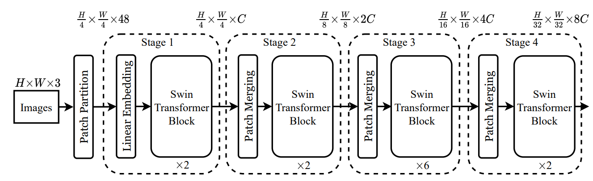

# Swin Transformer (Tiny) PyTorch Implementation

An implementation of the Swin Transformer in PyTorch, using Tiny ImageNet. Code is dataset agnostic

## Dataset

- **Input size**: 224×224 RGB
- **Train and Validation Lengths**
  - Train: 90000 images
  - Validation: 10000 images
- **Augmentations**
  - RandomResizedCrop(224)
  - RandomHorizontalFlip
  - Normalization
  - RandAugment
  - Random Erasing
  - Stochastic Depth

## Parameters

- Patch size: 4 × 4
- Base embed dim C: 96
- Depths: [2, 2, 6, 2]
- Num heads: [3, 6, 12, 24]
- Window size: 7 for all blocks
- Shift: 3 (7 // 2) for all shift blocks
- MLP expantion ratio: 4.0 for all blocks
- Drop path rate: 0.2 (linearly increased across all blocks)
- Patch Merging / Downsample at the end of Stage 1, 2 and 3.

**Stochastic depth for 12 total blocks: (np.linspace(0, 0.2, 12)):**

| Stage   | Rates                                    |
| ------- | ---------------------------------------- |
| Stage 1 | 0.0000, 0.0182                           |
| Stage 2 | 0.0364, 0.0545                           |
| Stage 3 | 0.0727, 0.0909, 0.1091, 0.1273, 0.1455, 0.1636 |
| Stage 4 | 0.1818, 0.2000                           |

## SwinBlock (Shifted Window Transformer Block)

Applies windowed self-attention over non overlapping M×M windows and alternates between non-shifted and shifted windows across consecutive blocks to enable cross-window connections. There is also an MLP with GELU at the end. Residual connections are used.

| Stage         | Blocks | Heads | Stoch_dep | In Channels | Out Channels | Output Shape             |
|---------------|--------|-------|-----------|-------------|--------------|--------------------------|
| PatchEmbed    | None   | None  | None           | 3           | 96           | (BS, H/4, W/4, 96)       |
| Stage 1       | 2      | 3     | [0.0000, 0.0182]          | 96          | 192          | (BS, H/8, W/8, 192)      |
| Stage 2       | 2      | 6     | [0.0364, 0.0545]          | 192         | 384          | (BS, H/16, W/16, 384)    |
| Stage 3       | 6      | 12    | [0.0727, 0.0909, 0.1091, 0.1273, 0.1455, 0.1636]          | 384         | 768          | (BS, H/32, W/32, 768)    |
| Stage 4       | 2      | 24    | [0.1818, 0.2000]          | 768         | 768          | (BS, H/32, W/32, 768)    |
| Head          | None   | None  | None          | 768         | num_classes  | (BS, num_classes)        |

## Swin Transformer Architecture

## Constraints

- img_size must be divisible by patch_size * 2^3
- For each stage, H and W should be multiples of the window size M

## Modules

- **Patchify:** Conv2d patch embedding (BS, 3, H, W) --> (BS, H/4, W/4, channels)
- **WindowAttention:** Multi-head attention over M×M tokens with relative position bias and an optional attention mask
- **create_attention_mask:** Prevents cross-window attention after cyclic shift
- **StochasticDepth:** Drops residual branches
- **PatchMerging:** Downsample 2x spatially, project channels --> 2*channels
- **Stage:** Stacks SwinBlocks with alternating shifts. Optional PatchMerging at the end

## Training

- **Optimizer:** AdamW(lr=0.0005, weight_decay=0.05, fused=True)
- **LR schedule:** Linear warmup for 5 epochs (1%-->100%) then Cosine for 95 epochs
- **Precision:** AMP (torch.cuda.amp Autocast + GradScaler)
- **Regularization:** Gradient clipping (max_norm=1.0), stochastic depth
- **Logging:** train_loss, train_acc, val_loss, val_acc, lr --> training_history.json
- **Checkpoint:** best by validation accuracy --> 'swin_t_best.pt'

Built by Kaizen Rowe