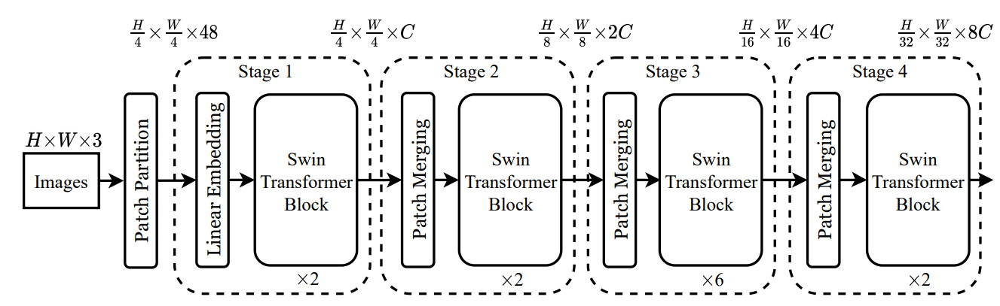
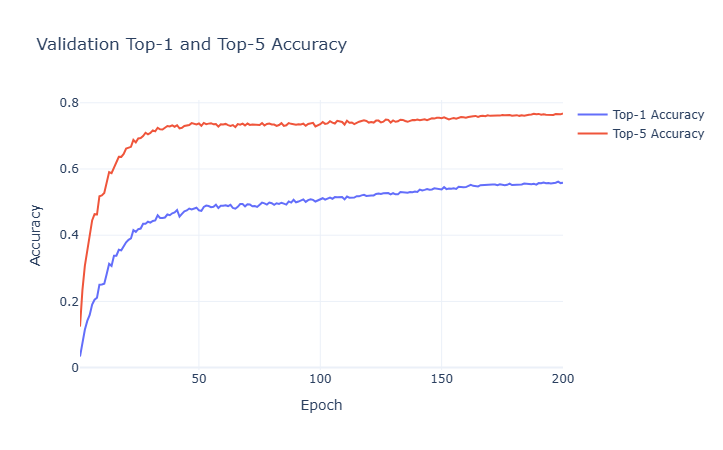

# Swin Transformer (Tiny) PyTorch Implementation

An implementation of the Swin Transformer in PyTorch, trained on Tiny ImageNet.
This project is based on the original paper "Swin Transformer: Hierarchical Vision Transformer using Shifted Windows", with several modifications from the published design. Swin Transformers are especially effective on large scale datasets with high resolution inputs, where ViT's quadratic self-attention complexity is not ideal. Tiny ImageNet's 64x64 resolution images are tiny, with a 4x4 patch size, the feature map is reduced to 16x16 tokens in the first stage, after three rounds, it is operating on a 2x2 token grid, leaving little spatial detail for the classifier. Validation Top1 accuracy plateaued around 56% which is on par with most classifiers, but by no means top tier performance. While Tiny ImageNet is useful for experimentation, training on the full ImageNet would better demonstrate Swin's scalability and performance advantages.

- **Input size**: 64×64 RGB
- **Augmentations**
  - RandomResizedCrop
  - RandomHorizontalFlip
  - Normalization
  - ColorJitter
  - RandAugment
  - Random Erasing
  - Stochastic Depth
  - Mixup
  - CutMix

## Parameters

- Patch size: 4 × 4
- Base embed dim C: 96
- Depths: [2, 2, 6, 2]
- Num heads: [2, 4, 8, 16]
- Window size: 7 for all blocks
- Shift: 3 (7 // 2) for all shift blocks
- MLP expantion ratio: 4.0 for all blocks
- Drop path rate: 0.2 (linearly increased across all blocks)
- Patch Merging / Downsample at the end of Stage 1, 2 and 3.

| Stage         | Blocks | Heads | Stoch_dep | In Channels | Out Channels | Output Shape             |
|---------------|--------|-------|-----------|-------------|--------------|--------------------------|
| PatchEmbed    | None   | None  | None           | 3           | 96           | (BS, H/4, W/4, 96)       |
| Stage 1       | 2      | 2     | [0.0000, 0.0182]          | 96          | 192          | (BS, H/8, W/8, 192)      |
| Stage 2       | 2      | 4     | [0.0364, 0.0545]          | 192         | 384          | (BS, H/16, W/16, 384)    |
| Stage 3       | 6      | 8     | [0.0727, 0.0909, 0.1091, 0.1273, 0.1455, 0.1636]          | 384         | 768          | (BS, H/32, W/32, 768)    |
| Stage 4       | 2      | 16    | [0.1818, 0.2000]          | 768         | 768          | (BS, H/32, W/32, 768)    |
| Head          | None   | None  | None          | 768         | num_classes  | (BS, num_classes)        |

## Swin Transformer Architecture

## SwinBlock (Shifted Window Transformer Block)

Applies windowed self-attention over non overlapping M×M windows and alternates between non-shifted and shifted windows across consecutive blocks to enable cross-window connections. There is also an MLP with GELU at the end. Residual connections are used.

## Constraints

- img_size must be divisible by patch_size * 2^3
- For each stage, H and W should be multiples of the window size M

## Modules

- **Patchify:** Conv2d patch embedding (BS, 3, H, W) --> (BS, H/4, W/4, channels)
- **WindowAttention:** Multi-head attention over M×M tokens with relative position bias and an optional attention mask
- **create_attention_mask:** Prevents cross-window attention after cyclic shift
- **StochasticDepth:** Drops residual branches
- **PatchMerging:** Downsample 2x spatially, project channels --> 2*channels
- **Stage:** Stacks SwinBlocks with alternating shifts. Optional PatchMerging at the end

## Training

- **Optimizer:** AdamW(param_groups_weight_decay(model, 0.05), lr=3e-4, betas=(0.9, 0.999), fused=True)
- **LR schedule:** Linear warmup for 10 epochs, then Cosine for 190 epochs
- **Precision:** AMP (torch.cuda.amp Autocast + GradScaler)
- **Regularization:** Gradient clipping (max_norm=3.0), stochastic depth
- **Logging:** train_loss, train_acc, val_loss, val_acc, lr --> [2, 2, 4, 2].json, [2, 2, 6, 2].json

Built by Kaizen Rowe